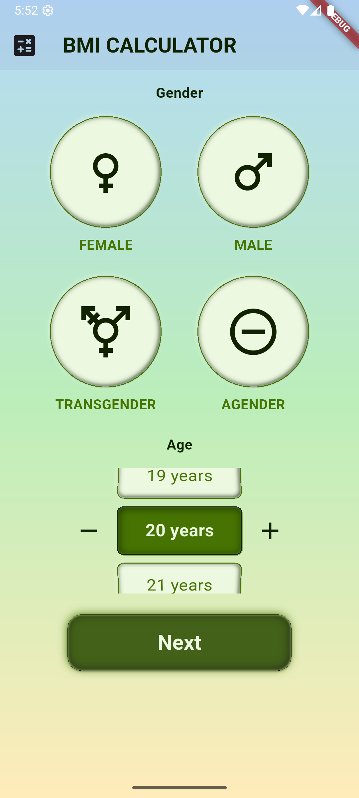
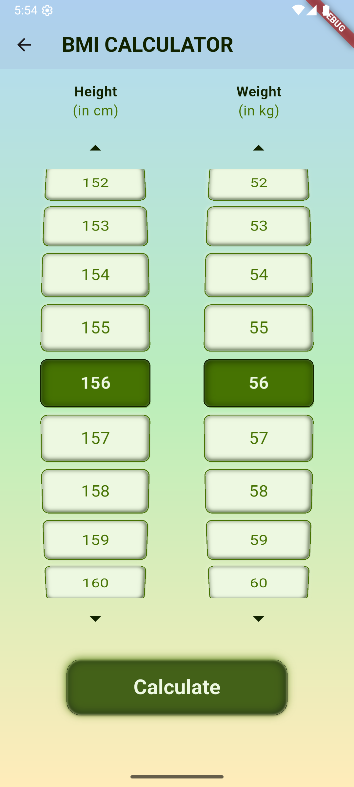
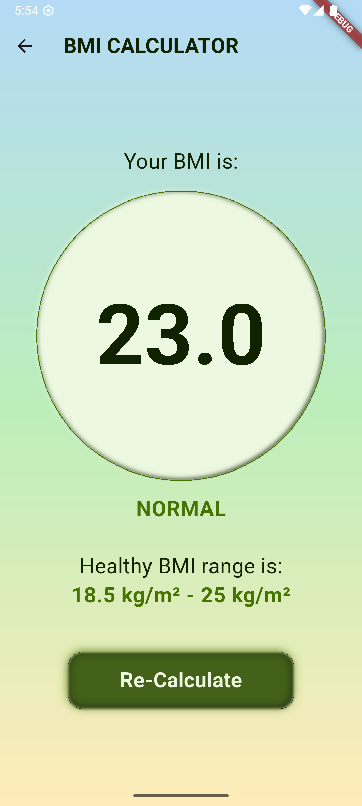

# BMI Calculator

A simple Body Mass Index (BMI) Calculator built using Flutter. This app allows users to input their height and weight, and calculates their BMI, providing an easy way to monitor their health.

## Table of Contents
- [Features](#features)
- [Installation](#installation)
- [Usage](#usage)
- [Screenshots](#screenshots)
- [Contributing](#contributing)

## Features
- Calculate BMI based on height and weight.
- Interactive UI with custom buttons and selectors.
- Gradient background for a visually appealing look.
- Splash screen with a transition to the main application.

## Installation
To run this project locally, follow these steps:

1. **Clone the repository:**
    ```bash
    git clone https://github.com/sayvilahsiav/bmi-calculator.git
    cd bmi-calculator
    ```

2. **Install dependencies:**
    ```bash
    flutter pub get
    ```

3. **Run the app:**
    ```bash
    flutter run
    ```

## Usage
1. Open the app.
2. On the splash screen, wait for a few seconds to transition to the main screen.
3. Enter your height (in cm) and weight (in kg) using the provided selectors.
4. Tap the 'Calculate' button to view your BMI.

## Screenshots

> A sneak peek into the experience of using the BMI Calculator app.

| Splash Screen                                   | Home Screen                                 |
|-------------------------------------------------|---------------------------------------------|
|  |  |

| Height & Weight Input                                           | BMI Result                                          |
|-----------------------------------------------------------------|-----------------------------------------------------|
|  |  |

| Live Demo                                            | Logo                                 |
|------------------------------------------------------|--------------------------------------|
|  |  |

## Contributing
Contributions are welcome! Please fork the repository and create a pull request with your changes.

1. Fork the repository.
2. Create a new branch: `git checkout -b feature-branch-name`.
3. Make your changes and commit them: `git commit -m 'Add some feature'`.
4. Push to the branch: `git push origin feature-branch-name`.
5. Open a pull request.

---
